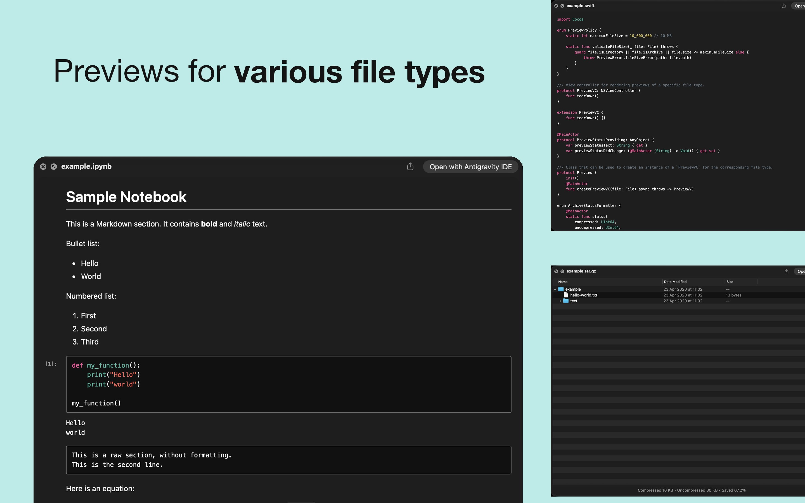
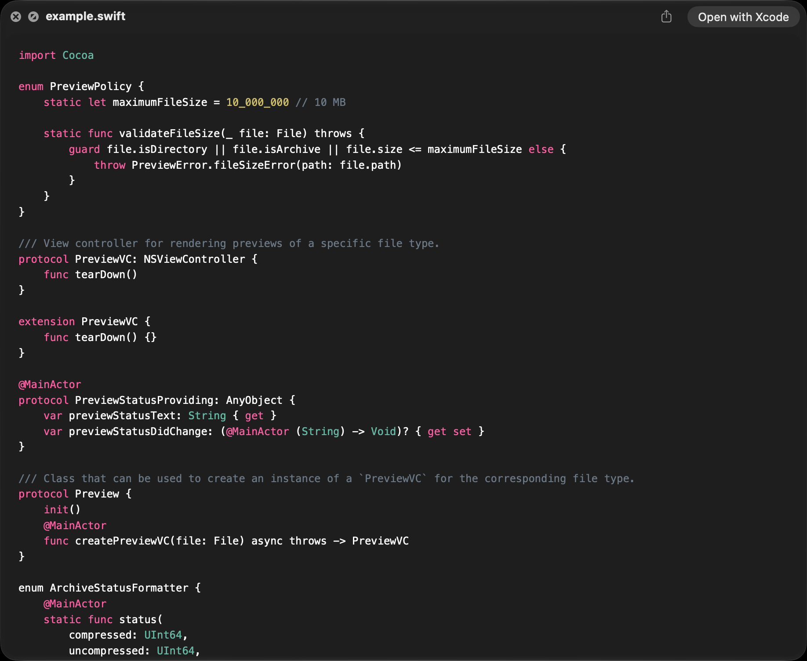
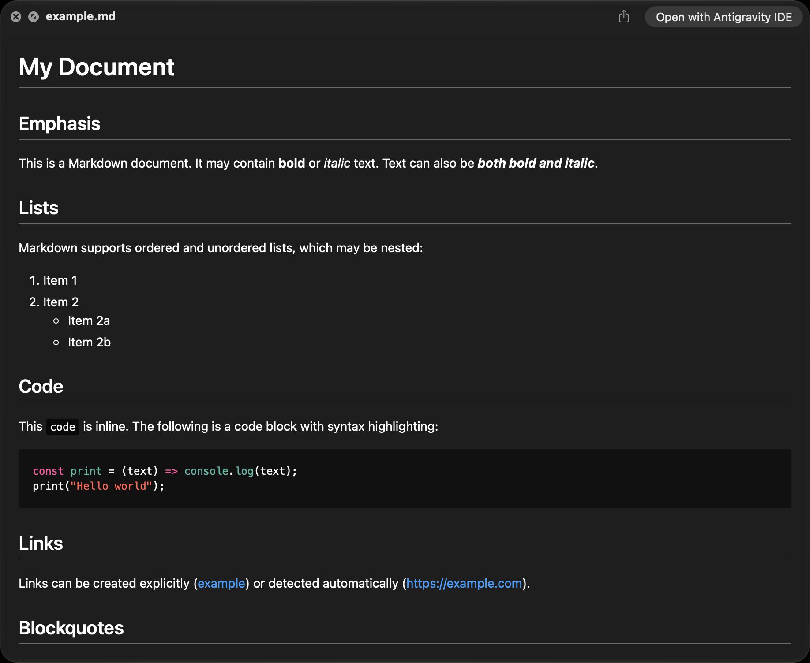
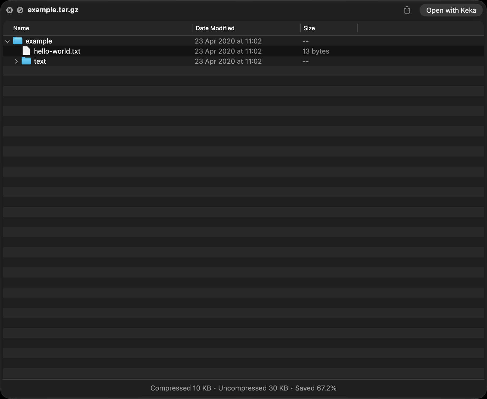
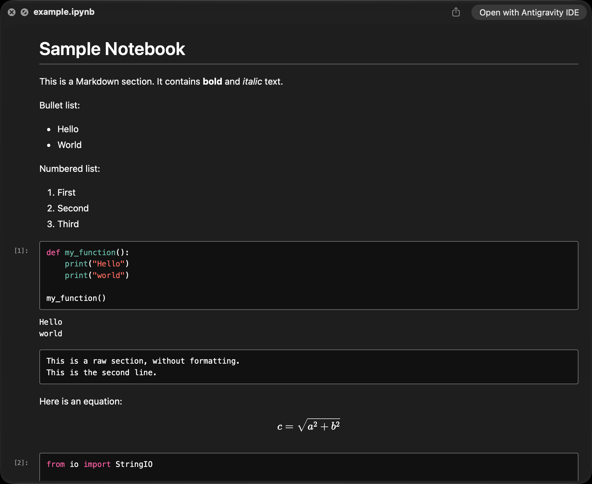
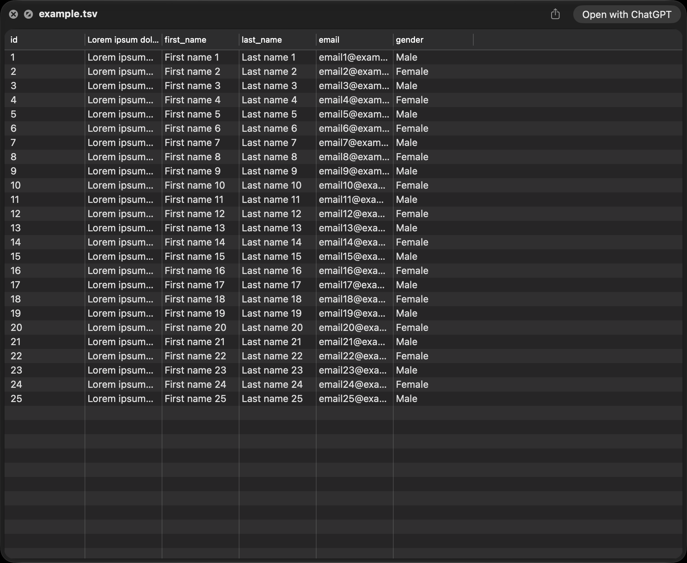

<div align="center">
	<p></p>
	<h1>Glance</h1>
	<p><strong>All-in-one Quick Look plugin</strong></p>
	<p>Glance provides Quick Look previews for files that macOS doesn't support out of the box.</p>
	<p><strong>Version 1.5.9 (build 19)</strong> · macOS 26 or later · Apple silicon</p>
	<p><a href="#installation">Installation Steps</a></p>
	<p></p>
</div>

> [!NOTE]
> This repository is a fork of [chamburr/glance](https://github.com/chamburr/glance) with additional maintenance and distribution work.
> Compared with upstream, this fork includes:
>
> - native macOS 26 Liquid Glass controls and adaptive window materials
> - Apple silicon-only builds
> - recursive folder previews with Finder-style icons and progressive thumbnails
> - in-place previews for nested folder items
> - a sandbox-safe Open With chooser that preserves default app associations
> - newer Quick Look and WebKit fixes
> - `.ini`, `.toml`, `.ttml`, and `.elrc` source-code previews
> - expanded archive support
> - safer bundled WebKit rendering
> - pinned `mise` build and test tooling with expanded automated coverage
> - downloadable unsigned DMGs from this fork's GitHub Releases
> - Settings controls for hiding the Dock icon
>
> Release DMGs are unsigned and unnotarized. Verify the attached SHA-256 checksum before using the quarantine-removal command shown in the installation steps.

## About

Glance extends the native Quick Look experience in Finder, Spotlight, and the Space-bar preview window. This maintained fork builds on [chamburr/glance](https://github.com/chamburr/glance) and the [original Glance plugin](https://github.com/samuelmeuli/glance), modernizing the app for current macOS releases while retaining local, lightweight previews.

Version **1.5.9** (build **19**) requires an Apple silicon Mac running macOS 26 or later. It uses native macOS materials and controls without stacking custom glass effects inside Quick Look's own window chrome.

## Installation

This maintained fork is distributed through [GitHub Releases](https://github.com/ranokay/glance/releases). The upstream Homebrew cask installs a separate upstream build and does not track releases from this fork.

Release DMGs are currently unsigned and unnotarized. To install Glance:

1. Download both `Glance-<version>.dmg` and `Glance-<version>.dmg.sha256` from the same release. In Terminal, change to their download directory and verify the disk image before opening it:

   ```sh
   shasum -a 256 -c Glance-<version>.dmg.sha256
   ```

2. Open the verified disk image and drag Glance.app to Applications.
3. If macOS blocks the app, remove the download quarantine attribute:

   ```sh
   xattr -rd com.apple.quarantine /Applications/Glance.app
   ```

4. Launch Glance once so macOS can register its Quick Look extension.
5. Keep Glance running while using its previews. You can hide its Dock icon in Settings; Glance remains available from the menu bar.

## Supported file types

- **Folders**: recursive, expandable trees with Finder-style icons and progressive image, video,
  and PDF thumbnails. Folder traversal skips hidden items and is bounded to 500 items and five
  levels. Double-click a file or package to preview it in place; Space does the same when the Quick
  Look host forwards that key. The utility bar can open the top-level file or a selected nested item
  once with any compatible app without changing its macOS default.

- **Source code and text** (with [Chroma](https://github.com/alecthomas/chroma) syntax highlighting): `.cpp`, `.elrc`, `.ini`, `.js`, `.json`, `.py`, `.swift`, `.toml`, `.ttml`, `.yml`, common extensionless configuration files, and many more

  <p></p>

- **Markdown** (rendered using [goldmark](https://github.com/yuin/goldmark)): `.md`, `.markdown`, `.mdown`, `.mkdn`, `.mkd`, `.Rmd`, `.qmd`

  <p></p>

- **Archive**: `.7z`, `.ear`, `.jar`, `.tar`, `.tar.gz`, `.tgz`, `.war`, `.zip`

  <p></p>

- **Jupyter Notebook** (rendered using [nbtohtml](https://github.com/samuelmeuli/nbtohtml)): `.ipynb`

  <p></p>

- **Tab-separated values** (parsed using [SwiftCSV](https://github.com/swiftcsv/SwiftCSV)): `.tab`, `.tsv`

  <p></p>

## FAQ

**There are existing Quick Look apps for some of the supported file types. Why create another one?**

- Glance combines the features of many plugins into one and provides consistent and beautiful previews.
- Glance follows light and dark appearance, window activation, Reduce Transparency, and Increase Contrast.
- Some plugins still use the deprecated Quick Look Generator API and might stop working in the future.
- Glance can easily be extended to support other file types.

**Why isn't the app available on older macOS versions or Intel Macs?**

The app uses the macOS 26 AppKit design system and intentionally ships Apple silicon-only builds.

**Why must Glance remain running?**

The containing app provides the sandbox-safe Open With bridge and keeps the extension available. Glance can stay unobtrusive in the menu bar with its Dock icon hidden.

**Why are images in my Markdown files not loading?**

Glance blocks remote assets. Furthermore, the app only has access to the file that's being previewed. Local image files referenced from Markdown are therefore not loaded.

**Does Open With change my default application?**

No. Glance opens the selected file once with the chosen compatible app. It does not modify Launch Services or the file type's default application association.

**Why isn't [file type] supported?**

Feel free to [open an issue](https://github.com/ranokay/glance/issues/new) or [contribute](#contributing)! When opening an issue, please describe what kind of preview you'd expect for your file.

Please note that macOS doesn't allow the handling of some file types (e.g. `.plist`, `.ts` and `.xml`).

**How do I disable Glance for a file type?**

Glance doesn't currently support disabling individual file types.

**You claim to support [file type], but previews aren't showing up.**

Glance skips non-archive files larger than 10 MB to avoid slowing down your Mac. Folder previews are separately bounded to 500 items and five levels.

It's possible that your file's extension or [UTI](https://en.wikipedia.org/wiki/Uniform_Type_Identifier) isn't associated with Glance. You can easily verify this:

1. Check whether the file extension is matched to the correct class in [`PreviewVCFactory.swift`](./QLPlugin/Views/PreviewVCFactory.swift).
2. Find your file's UTI by running `mdls -name kMDItemContentType /path/to/your/file`. Check whether the UTI is listed under `QLSupportedContentTypes` in [`Info.plist`](./QLPlugin/Info.plist).
3. If an association is missing, please feel free to add it and submit a PR.

## Contributing

Suggestions and contributions are always welcome! Please discuss larger changes (e.g. adding support for a new file type) in a [fork issue](https://github.com/ranokay/glance/issues) before submitting a pull request.

Building requires Xcode 26 on an Apple silicon Mac running macOS 26, plus
[mise-en-place](https://mise.jdx.dev/). From the repository root, run `mise install` once to install
the pinned Go, SwiftFormat, and SwiftLint versions.
Common local commands are:

- `mise run test` to run the Go and Xcode test suites
- `mise run build` to build the app in the `build` directory
- `mise run verify` to run tests and a release build
- `mise run all` to build, install into `/Applications`, register the Quick Look extension, and
  reset Quick Look

To add previews for a new file extension, please follow these steps:

1. Create a new class in [`QLPlugin/Views/Previews`](./QLPlugin/Views/Previews/) that implements the `Preview` protocol.
2. Add its match rule to [`SupportedPreviewRegistry.swift`](./Glance/Shared/Utils/SupportedPreviewRegistry.swift) and map its preview type in [`PreviewVCFactory.swift`](./QLPlugin/Views/PreviewVCFactory.swift).
3. Find the file's UTI with `mdls -name kMDItemContentType /path/to/your/file`, then add it to `QLSupportedContentTypes` in [`QLPlugin/Info.plist`](./QLPlugin/Info.plist).
4. Update this README, [`SupportedFilesWC.swift`](Glance/SupportedFilesWC.swift), the [App Store description](AppStore/Listing/Description.txt), and [`Credits.rtf`](Glance/Credits.rtf) if a new library was introduced.

## License

This project is licensed under [MIT License](LICENSE.md).
